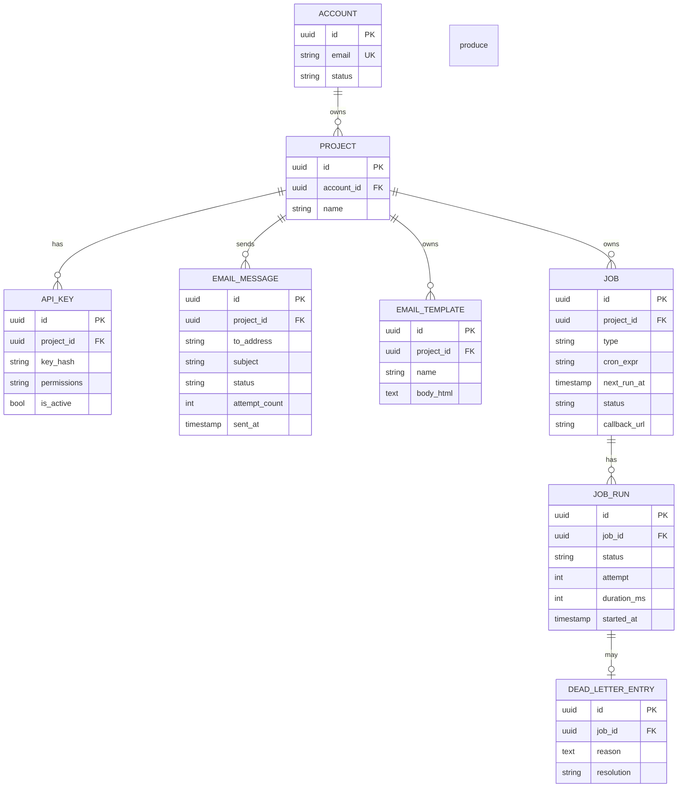

# ER Diagram — Mini AWS Platform

---

## Table Notes

| Table | Purpose |
|-------|---------|
| `ACCOUNT` | A registered developer |
| `PROJECT` | A workspace under an account — all resources are scoped here |
| `API_KEY` | Credential used to call the platform; stored as a hash |
| `EMAIL_MESSAGE` | One email send — tracks lifecycle from queued to sent/failed |
| `EMAIL_TEMPLATE` | Reusable email with `{{variable}}` placeholders |
| `JOB` | A scheduled task definition (one-time or recurring cron) |
| `JOB_RUN` | One execution record per job trigger |
| `DEAD_LETTER_ENTRY` | Jobs that failed all retries, preserved for inspection |