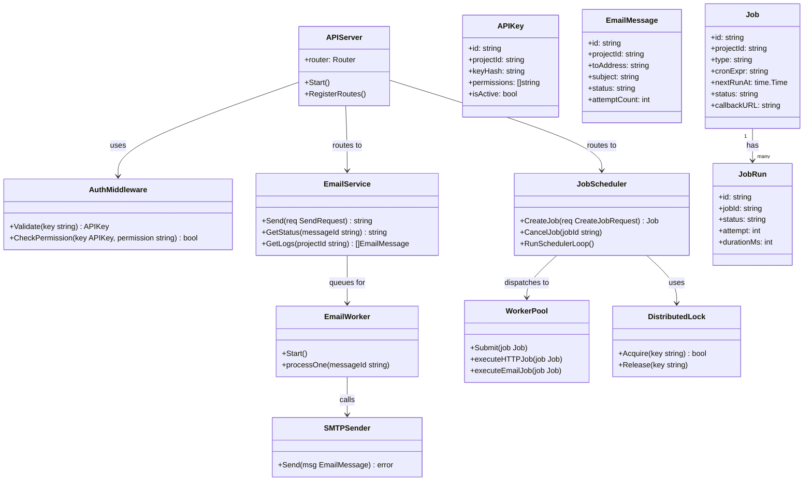

# Class Diagram — Mini AWS Platform

```mermaid
classDiagram

    class APIServer {
        +router: Router
        +Start()
        +RegisterRoutes()
    }

    class AuthMiddleware {
        +Validate(key string) APIKey
        +CheckPermission(key APIKey, permission string) bool
    }

    class APIKey {
        +id: string
        +projectId: string
        +keyHash: string
        +permissions: []string
        +isActive: bool
    }

    class EmailService {
        +Send(req SendRequest) string
        +GetStatus(messageId string) string
        +GetLogs(projectId string) []EmailMessage
    }

    class EmailMessage {
        +id: string
        +projectId: string
        +toAddress: string
        +subject: string
        +status: string
        +attemptCount: int
    }

    class EmailWorker {
        +Start()
        +processOne(messageId string)
    }

    class SMTPSender {
        +Send(msg EmailMessage) error
    }

    class JobScheduler {
        +CreateJob(req CreateJobRequest) Job
        +CancelJob(jobId string)
        +RunSchedulerLoop()
    }

    class Job {
        +id: string
        +projectId: string
        +type: string
        +cronExpr: string
        +nextRunAt: time.Time
        +status: string
        +callbackURL: string
    }

    class JobRun {
        +id: string
        +jobId: string
        +status: string
        +attempt: int
        +durationMs: int
    }

    class WorkerPool {
        +Submit(job Job)
        +executeHTTPJob(job Job)
        +executeEmailJob(job Job)
    }

    class DistributedLock {
        +Acquire(key string) bool
        +Release(key string)
    }

    APIServer --> AuthMiddleware : uses
    APIServer --> EmailService : routes to
    APIServer --> JobScheduler : routes to

    EmailService --> EmailWorker : queues for
    EmailWorker --> SMTPSender : calls

    JobScheduler --> WorkerPool : dispatches to
    JobScheduler --> DistributedLock : uses
    Job "1" --> "many" JobRun : has
```