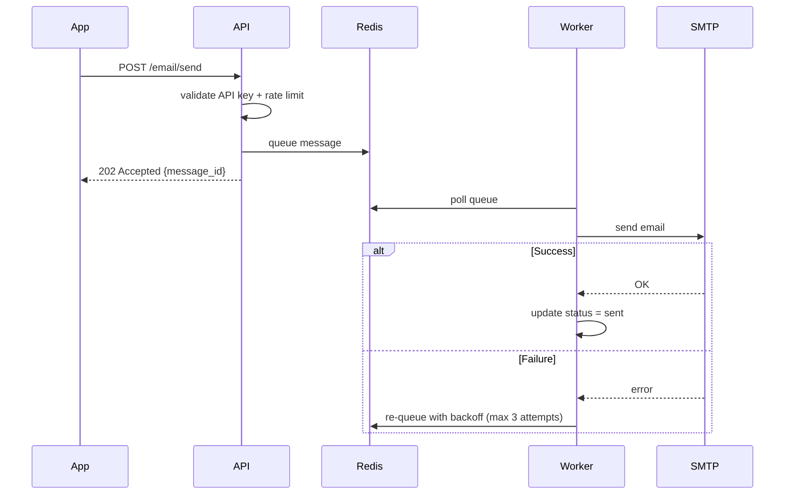
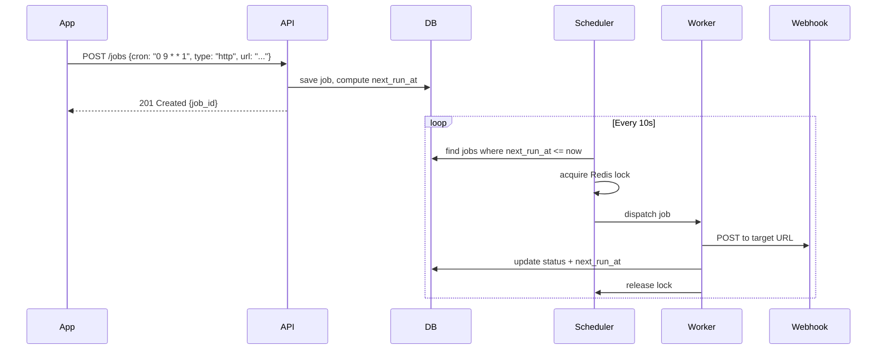
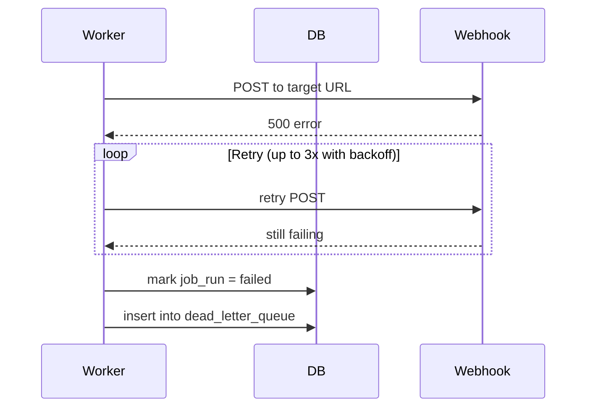

# Sequence Diagram — Mini AWS Platform

---

## Flow 1: Send an Email

```mermaid
sequenceDiagram
    participant App
    participant API
    participant Redis
    participant Worker
    participant SMTP

    App->>API: POST /email/send
    API->>API: validate API key + rate limit
    API->>Redis: queue message
    API-->>App: 202 Accepted {message_id}

    Worker->>Redis: poll queue
    Worker->>SMTP: send email
    alt Success
        SMTP-->>Worker: OK
        Worker->>Worker: update status = sent
    else Failure
        SMTP-->>Worker: error
        Worker->>Redis: re-queue with backoff (max 3 attempts)
    end
```

---

## Flow 2: Schedule a Cron Job

```mermaid
sequenceDiagram
    participant App
    participant API
    participant DB
    participant Scheduler
    participant Worker
    participant Webhook

    App->>API: POST /jobs {cron: "0 9 * * 1", type: "http", url: "..."}
    API->>DB: save job, compute next_run_at
    API-->>App: 201 Created {job_id}

    loop Every 10s
        Scheduler->>DB: find jobs where next_run_at <= now
        Scheduler->>Scheduler: acquire Redis lock
        Scheduler->>Worker: dispatch job
        Worker->>Webhook: POST to target URL
        Worker->>DB: update status + next_run_at
        Worker->>Scheduler: release lock
    end
```

---

## Flow 3: Job Fails → Dead Letter Queue

```mermaid
sequenceDiagram
    participant Worker
    participant DB
    participant Webhook

    Worker->>Webhook: POST to target URL
    Webhook-->>Worker: 500 error

    loop Retry (up to 3x with backoff)
        Worker->>Webhook: retry POST
        Webhook-->>Worker: still failing
    end

    Worker->>DB: mark job_run = failed
    Worker->>DB: insert into dead_letter_queue
```