# Use Case Diagram — Mini AWS Platform

```mermaid
flowchart TD
    DEV[Developer / App]
    ADMIN[Admin]
    WORKER[Internal Worker]

    subgraph Platform
        subgraph Auth
            UC1[Register & Get API Key]
        end

        subgraph Email Service
            UC2[Send Email]
            UC3[Create Template]
            UC4[Check Delivery Status]
            UC5[View Email Logs]
        end

        subgraph Job Scheduler
            UC6[Submit One-Time Job]
            UC7[Schedule Cron Job]
            UC8[Cancel Job]
            UC9[View Job History]
        end

        subgraph Internal
            UC10[Process Email Queue]
            UC11[Execute Scheduled Job]
            UC12[Deliver Webhook]
        end
    end

    DEV --> UC1
    DEV --> UC2
    DEV --> UC3
    DEV --> UC4
    DEV --> UC5
    DEV --> UC6
    DEV --> UC7
    DEV --> UC8
    DEV --> UC9

    ADMIN --> UC1
    WORKER --> UC10
    WORKER --> UC11
    WORKER --> UC12
```

---

## Use Cases

### Auth
| Use Case | Description |
|----------|-------------|
| Register & Get API Key | Create an account, generate a scoped API key to call our services |

### Email Service
| Use Case | Description |
|----------|-------------|
| Send Email | POST a single or bulk email request. Returns a message ID immediately. |
| Create Template | Store a reusable email template with `{{variable}}` placeholders |
| Check Delivery Status | Poll status of a sent email: queued, sent, bounced, or failed |
| View Email Logs | Paginated history of all emails sent under this API key |

### Job Scheduler
| Use Case | Description |
|----------|-------------|
| Submit One-Time Job | Run a job immediately or at a specific future time |
| Schedule Cron Job | Set a recurring job using a standard cron expression |
| Cancel Job | Remove a pending job before it runs |
| View Job History | See past runs with status, duration, and error details |

### Internal Worker
| Use Case | Description |
|----------|-------------|
| Process Email Queue | Worker polls Redis, calls SMTP, updates delivery status in DB |
| Execute Scheduled Job | Scheduler loop finds due jobs, acquires lock, runs the job |
| Deliver Webhook | POST job result to the developer's callback URL after completion |